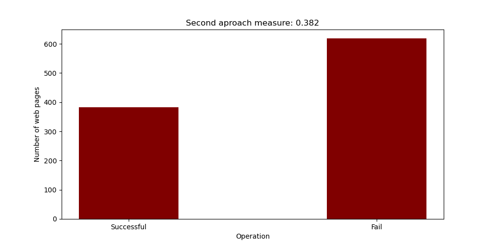
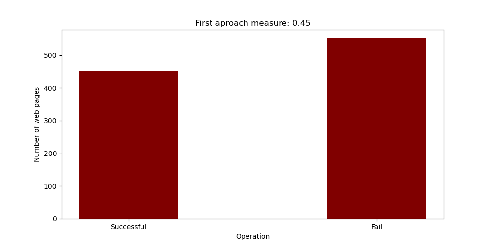

This page shows two variations of the algorithm, the first one access directly to the url information, the second one uses a proxy url and a authentication key in order to avoid restriction and it waits more time for a response. Also the percentage of retrieved logos are calculated as a quality measure for the two approaches.

